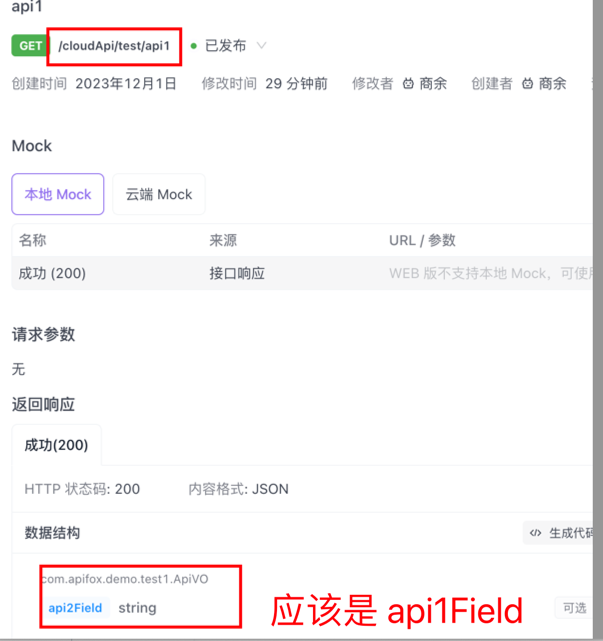

1. 两个接口，api1接口 和 api2接口
2. api1接口的返回类型是 test1.ApiVO，包含字段 api1Field, api2接口的返回类型是 test2.ApiVO，包含字段 api2Field
3. 导出接口时，后导出的接口会覆盖前面导出的接口的返回值。
4. 比如先导出 api1，再导出api2 
4. 期望的结果是： api1接口的返回值是 test1.ApiVO，包含字段 api1Field, api2接口的返回值是 test2.ApiVO，包含字段 api2Field
5. 实际的结果是： api1接口的返回值是 test2.ApiVO，包含字段 api2Field, api2接口的返回值是 test2.ApiVO，包含字段 api2Field

